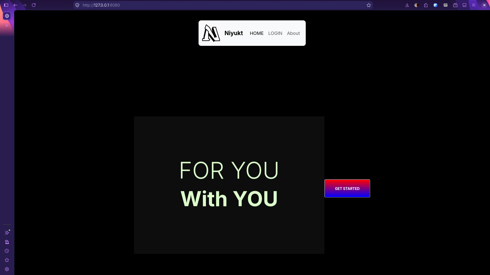
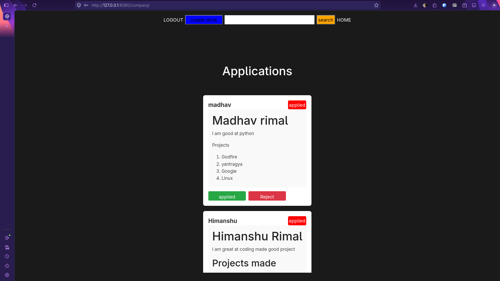
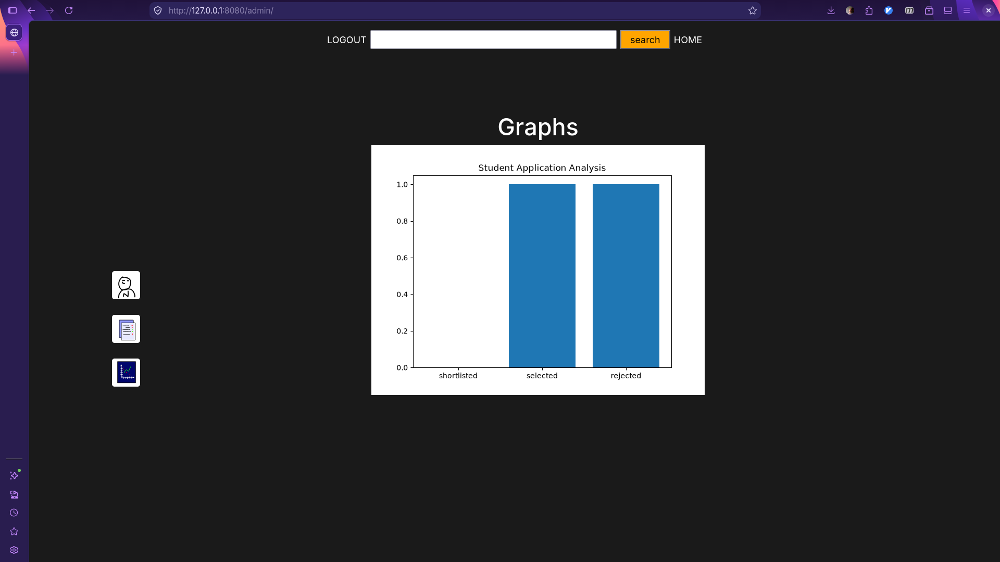
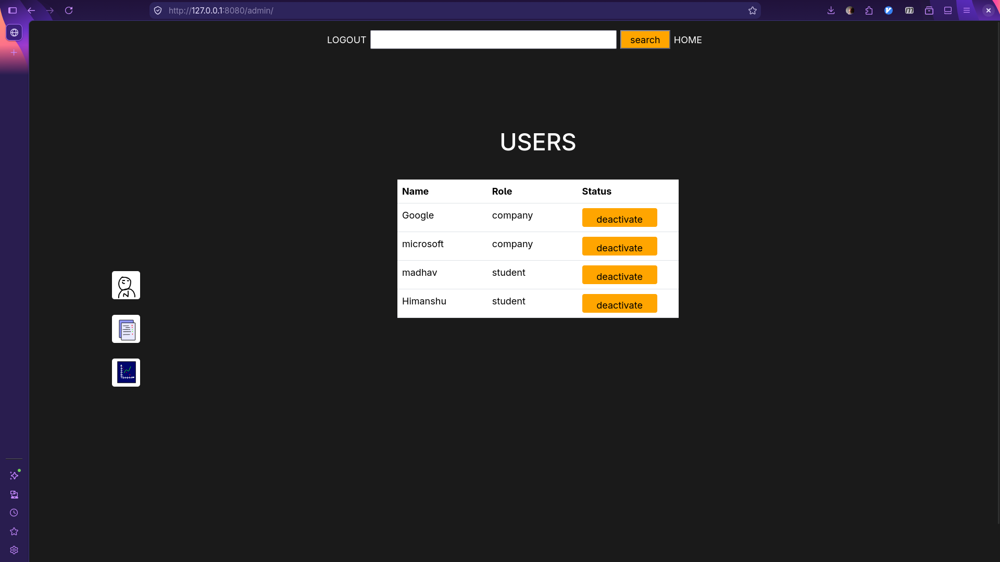

# Niyukt
A Solution for college to manage placement drives,
Student to be niyukt, 

## GOAL
    **Making Minimal usable website for students, company and college admins to maange students placements**

Core functionality
    1. students can apply for Jobs
    2. Company can list all applications and select students
    3. Finalize Final students --> student gets updates offer listing
    4. Data History of all operations 
    5. Admin control over all operations

## Project Show case screenshots - Designs are self made

## Setup Guide for project

Make virtual environement
`python3 -m venv .venv`
`source .venv/bin/activate`

then download the dependencies
`pip install -r requirements.txt`
`python load_admin.py`  Load admin to control into application
`python app.py`

Project starts running visit : 8080 port on web

## Explored Designing with grace
1. DB Schema and logic
    This app contains well crafted schema desing with using full power of Data base technology, using triggers, views and logical scrict checking embeded into the core tables ensuring good and reliable system.

2. Custom ORM-mini version
    ~ Learnt the inner working of ORM for query execution
    Explored critical restraints into making scalable backend service, and bottle neck made with execution pipeline, 
    Tried to make Central Executor mechanism which would run in independent thread for pooling all DB calls and Execution, but due to complexity its aimed as Enhancement for future launch of project
3. Testing Automation
    Tried to implement simple pytest based testing for the api and core units, learnt to make sure to keep system stable while developing
4. Made custom crafted icons and UI design
    Pleased to learn about design and crafting minimal aestehtic interfaces.
5. Made JS Based Targeted rendering for dashboard, explored async loading and fetch request from frontend for making renders into the dashboard UI,

## Critical Learning
+ Making placeholder based query for both columns and values
    Learning : How placeholder based system works
        ~ Placeholder makes void for the final plug into during execution of query thus if we give columns into placeholder it would be considered as literal in execution thus we just pass placeholder into the values of the given query input.  
